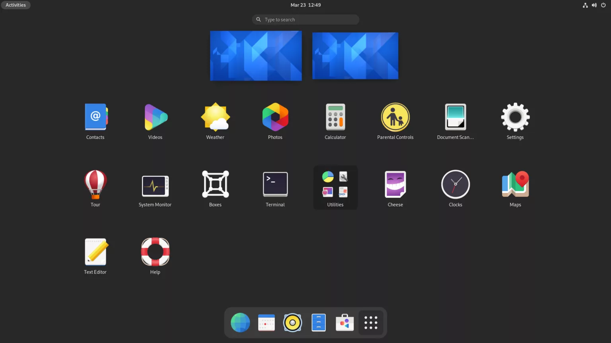
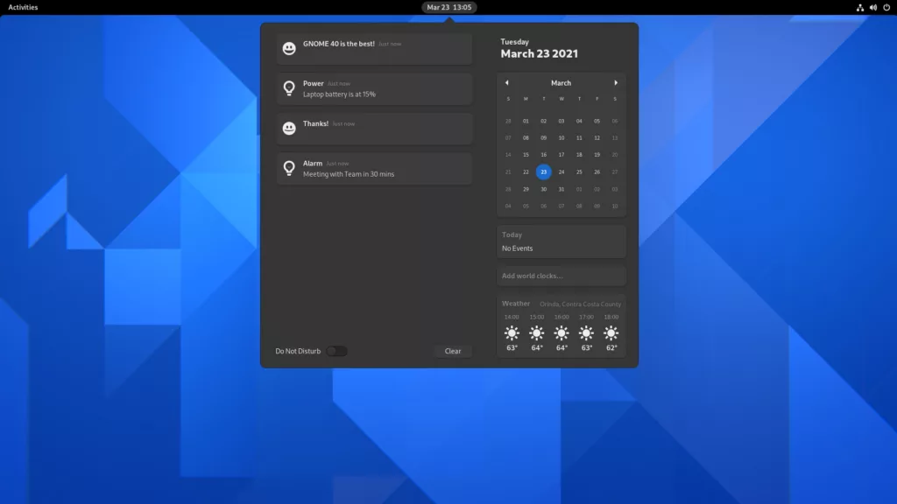
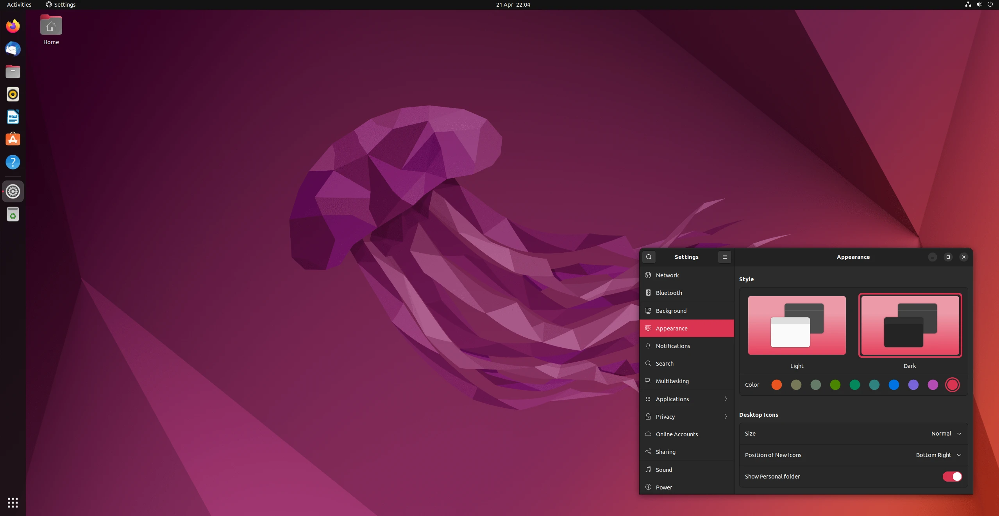

# GNOME

Gnome ist eine grafische Oberfläche, die für Einfachheit des Linux System stehen.
Das Ziel von Gnome ist es, dass auch Personen, die keine technischen Kenntnisse haben, Linux benutzen können.

## Architektur

Gnome basiert auf einer modularen Struktur, das bedeutet, es ist in Module und Libraries eingeteilt.

## Installation

before you install anything update apt-get
```sh
sudo apt-get update
```

Install Gnome 
```sh
sudo apt-get install gnome
```

Install Gnome minimal 
```sh
sudo apt-get install gnome-core
```

Install Gnome Shell 
```sh
sudo apt-get install gnome-shell 
```

Install Gnome Ubuntu Theme 
```sh
sudo apt-get install ubuntu-desktop
```

## Bilder

### Gnome Desktop


### Ubuntu Desktop


## Ursprung

Das Gnome Projekt wurde im Jahr 1997 gestartet und war eine Antwort auf [KDE](kde.md).
Anfangs hatte Gnome keine freie Software-Lizenz 

Im November 1998 änderten sie die Lizenz auf QPL und

Im September 2000 veröffentlichen Gnome dazu auch eine GNU Version.

Ab Juni 2005 im dualen Lizenzsystem.

In Gnome hat man sich entschieden, das GTK (Gimp-Toolkit) zu verwenden.
Der Hauptvorteil ist, dass sie unter eine Open-Source-Lizenz steht, durch das hat das Gnome-Team mehr Möglichkeiten für Lizenzen.
Dazu basiert das GTK auf C, das auf den meisten Geräten laufen kann und bessere Anbindungen an andere Programmiersprachen hat.