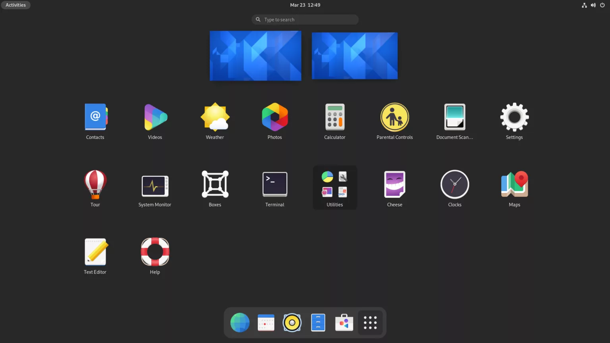
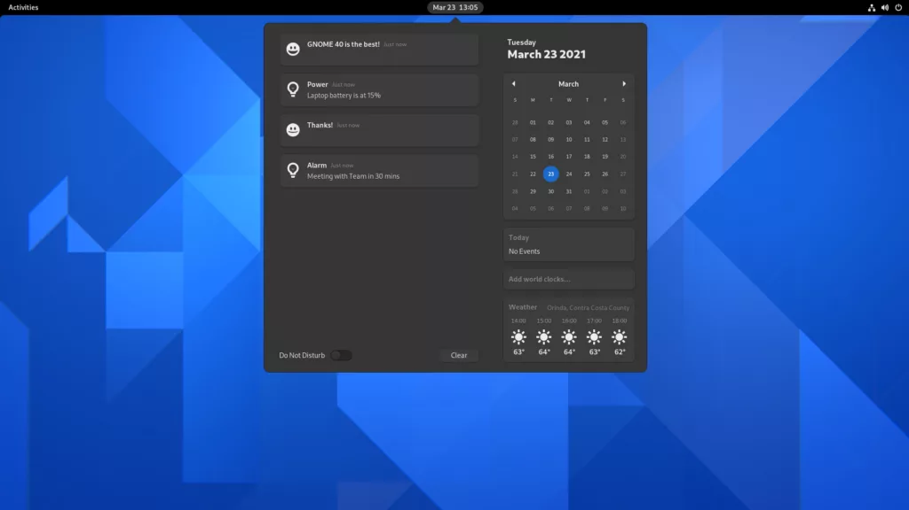
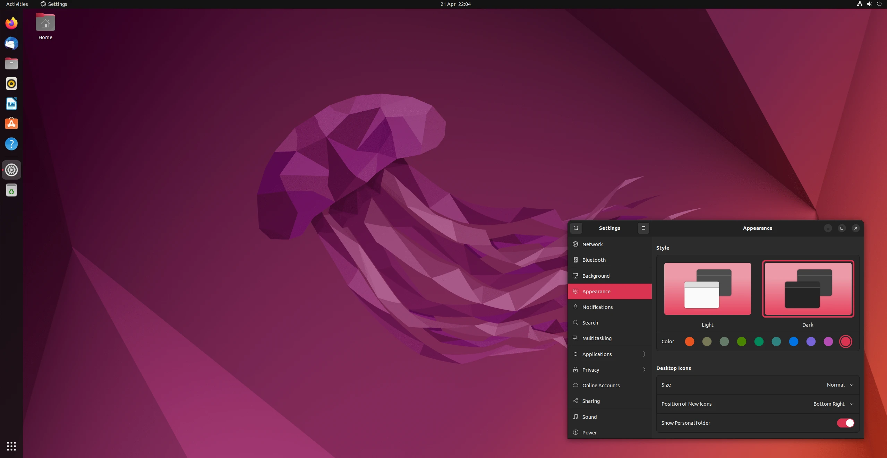

# 👣 GNOME

Gnome ist eine grafische Oberfläche die für einfachheit des Linux system stehen.
Das Ziel von Gnome ist das auch die personen die keine Technischekenntnisse haben auch Linux benutzen können.

## Architektur

Gnome basiert auf einer modularend struktur das bedeutet es ist in Module und Libraries eigeteilt.

## Installation

before you install anything update apt-get
```sh
sudo apt-get update
```

Install Gnome 
```sh
sudo apt-get install gnome
```

Install Gnome minimal 
```sh
sudo apt-get install gnome-core
```

Install Gnome Shell 
```sh
sudo apt-get install gnome-shell 
```

Install Gnome Ubuntu Theme 
```sh
sudo apt-get install ubuntu-desktop
```

## Bilder

### Gnome Desktop


### Ubuntu Desktop
