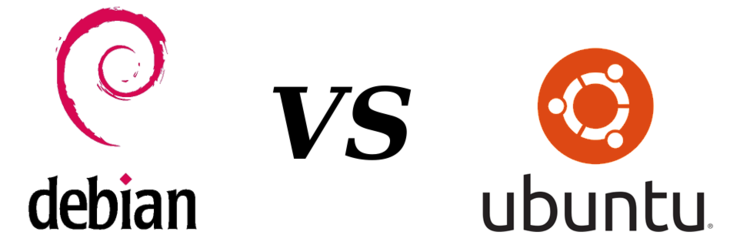

# Debian

## Einführung

Debian ist ein zuverlässiges, sicheres und quelloffenes Betriebssystem, das auf die Unterstützung freier Software stolz ist. Es wird das APT-Paketverwaltungssystem verwendet und unterstützt eine Reihe von Hardware-Architekturen. Debian ist die Basis für bekannte Linux-Distributionen wie Ubuntu und folgt der Philosophie "Release when ready".

## Geschichte

Vorstellung von die Geschichte von Debian und was es so populär gemacht hat:

- Debian existiert seit 1993, als Ian Murdock, ein Student der Informatik a der Purdue University, das Projekt gründete. Sein Ziel war es, ein freies, quelloffenes Betriebssystem zu entwickeln und zu betreuen, das von einer Community von Freiwilligen entwickelt und betreut werden sollte.

- Am 15. September 1993 veröffentlichte Murdock Debian 0.01, die erste Version von Debian. Der Name „Debian“ stammt aus der Kombination seines eigenen Namens und des Namens seiner ehemaligen Frau Debra.

- Debian hatte von Anfang an das Ziel, mehr als nur eine Linux-Distribution zu sein. Es wollte ein Betriebssystem entwickeln, das frei entwickelt und frei verteilt werden kann und keinen proprietären Beschränkungen unterliegt, indem es sich a die Prinzipien der Freien Softwarebewegung orientierte.

- Debian hat aufgrund seines Engagements für Stabilität, Zuverlässigkeit und Freiheit eine robuste Infrastruktur und strenge Qualitätskontrollprozesse entwickelt. Die Debian-Richtlinien für freie Software (DFSG) wurden vom Projekt erstellt, um zu definieren, was freie Software ist, und um sicherzustellen, dass jede in Debian integrierte Software diese Richtlinien befolgt.

- Im Jahr 1997 wurde das Advanced Package Tool (APT) des Paketverwaltungssystems von Debian veröffentlicht, welches einer der wichtigsten Merkmale von Debian wurde.

- Debian hat sich im Laufe der Zeit zu einer der führenden Linux-Distributionen entwickelt. Es ist beliebt für Server und unternehmenskritische Systeme aufgrund seiner Stabilität und Zuverlässigkeit. Debian war die Basis für viele andere Distributionen, darunter Ubuntu, das sehr beliebt und einfach zu bedienen ist.

- Debian ist weiterhin ein Projekt, das von der Community unterstützt wird. Anstatt sich a feste Veröffentlichungstermine zu halten, verfolgt es einen „Release when ready“-Ansatz, der sich auf Qualität und Stabilität konzentriert. Um den unterschiedlichen Bedürfnissen und Vorlieben der Benutzer gerecht zu werden, hat das Projekt mehrere Zweige, darunter Stable, Testing und Unstable.

- Heutzutage hält Debian an seinen Grundsätzen fest und bietet ein vielseitiges und zuverlässiges Betriebssystem, das eine lebendige Gemeinschaft fördert. Es entwickelt sich weiter und bietet Benutzern eine kostenlose und zuverlässige Computerplattform.

## Was genau macht APT?

Das APT (Advanced Package Tool) von Debian erleichtert die Installation und Aktualisierung von Software. Es unterstützt Sicherheitsaktualisierungen, bietet Kommandozeilenwerkzeuge wie 'apt-get' und 'apt-cache' und verwaltet automatisch Abhängigkeiten. Die Benutzer können Software-Repositories konfigurieren, indem sie APT-Pakete verwenden. APT ist aufgrund seiner Flexibilität und Effizienz ein wesentlicher Bestandteil der Paketverwaltung von Debian.

## Debian VS Ubuntu

Debian und Ubuntu sind zwei beliebte Linux-Distributionen, die in der Open-Source-Gemeinschaft einen grossen Einfluss haben. Obwohl beide einen gemeinsamen Ursprung haben, weisen sie unterschiedliche Merkmale auf, die sie voneinander unterscheiden.

1. Release Cycle:
Debian folgt einem Veröffentlichungsmodell, das als "Stable" bekannt ist und der Stabilität Vorrang vor den neuesten Funktionen einräumt. Dieser Ansatz stellt sicher, dass Software umfangreichen Tests unterzogen wird, bevor sie in eine stabile Veröffentlichung aufgenommen wird. Folglich sind die stabilen Veröffentlichungen von Debian für ihre Zuverlässigkeit bekannt, aber sie enthalten möglicherweise nicht die aktuellsten Softwareversionen. Ubuntu hingegen hat einen häufigeren Veröffentlichungszyklus, bei dem alle sechs Monate neue Versionen erscheinen. Die regelmäßigen Veröffentlichungen bieten den Benutzern die neuesten Funktionen, Verbesserungen und aktualisierte Softwarepakete. Außerdem gibt es bei Ubuntu alle zwei Jahre Long Term Support (LTS)-Versionen, die über einen längeren Zeitraum (in der Regel fünf Jahre) mit erweiterten Wartungs- und Sicherheitsupdates versorgt werden.

1. Package Management:
Sowohl Debian als auch Ubuntu nutzen das APT-Paketverwaltungssystem, mit dem die Benutzer Softwarepakete einfach installieren, aktualisieren und verwalten können. Das von der Gemeinschaft gepflegte Paketarchiv von Debian konzentriert sich auf Stabilität und Zuverlässigkeit, während Ubuntu seine eigene strukturierte Softwareauswahl hinzufügt, um die Benutzererfahrung zu verbessern. Debians "Testing"- und "Unstable"-Zweige bieten Zugang zu neueren Softwareversionen, während Ubuntu einen benutzerfreundlicheren und vorgefertigten Ansatz bietet, der für Desktop-Benutzer und Anfänger geeignet ist.

1. Support
Debian und Ubuntu haben grosse und aktive Gemeinschaften, die zu ihrer Entwicklung beitragen und Unterstützung leisten. Der benutzerfreundliche Ansatz von Ubuntu hat jedoch eine breitere Benutzerbasis angezogen, was zu einem einsteigerfreundlicheren Support-Ökosystem führt. Ubuntu verfügt über ein offizielles Supportsystem, das Gemeinschaftsforen, Dokumentation und professionelle Dienste umfasst.
Die Debian-Gemeinschaft ist bekannt für ihr technisches Fachwissen und ihre Hingabe an die Prinzipien freier Software. Während es bei Debian keine offiziellen bezahlten Support-Optionen gibt, sind die Community-Support-Kanäle, Mailinglisten und Foren gut etabliert und bieten umfassende Hilfe für Benutzer.

Debian und Ubuntu haben zwar eine gemeinsame Abstammung, unterscheiden sich aber in dem Veröffentlichungszyklus, der Paketauswahl und den Supportmechanismen. Debian legt den Schwerpunkt auf Stabilität, Sicherheit und Softwarefreiheit, während Ubuntu den Schwerpunkt auf Benutzerfreundlichkeit und einfache Installation legt. Die Wahl zwischen den beiden hängt von individuellen Vorlieben, technischen Anforderungen und dem gewünschten Gleichgewicht zwischen modernster Software und Stabilität ab.
