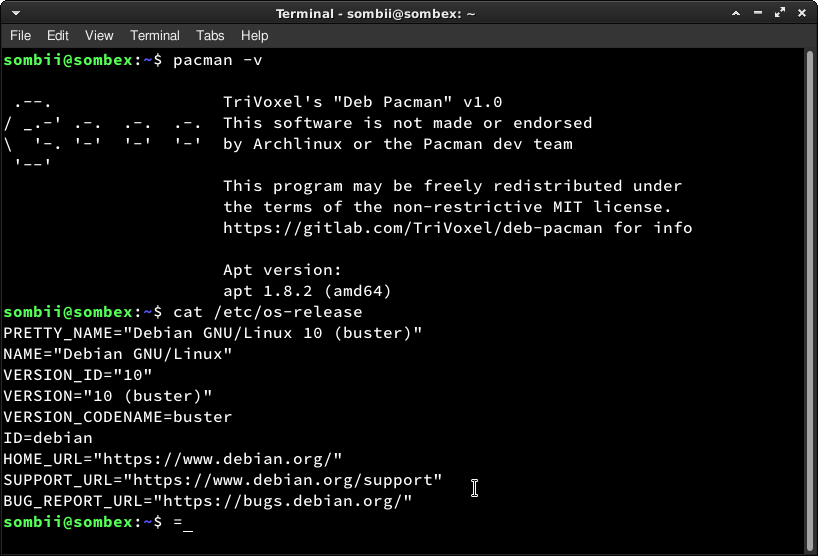

# Linux-Distributionen

Linux-Distributionen unterscheiden sich in mehreren Aspekten:

- **Paketverwaltungssystem**: Unterschiedliche Distributionen verwenden verschiedene Paketverwaltungssysteme wie APT, RPM oder Pacman.

- **Zielgruppe und Verwendungszweck**: Distributionen wie Ubuntu sind benutzerfreundlich und für Desktops geeignet, während CentOS auf Stabilität und den Einsatz in Unternehmensumgebungen abzielt.

- **Release-Modell**: Manche Distributionen folgen einem festen Veröffentlichungszyklus, andere verwenden das Rolling-Release-Modell für kontinuierliche Updates.

- **Standardmässig installierte Software**: Jede Distribution enthält eine Auswahl an Standardsoftwarepaketen, die je nach Vorlieben der Entwickler und Zielgruppe variiert.

- **Community und Unterstützung**: Jede Distribution hat ihre eigene Entwickler- und Benutzercommunity, die Unterstützung und Dokumentation bietet.

- **Desktop-Umgebung**: Die Wahl der Desktop-Umgebung kann zwischen den Distributionen variieren.

## Bekannte Linux-Distributionen

Um mehr über die einzelne wichtige Distributionen zu erfahren, klickt auf die Links:

* [Debian](../debian/debian.md)

* [Fedora](../fedora.md)

* [WSL Setup](../wsl.md)
