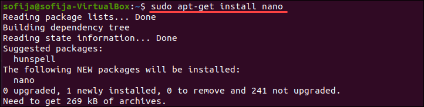
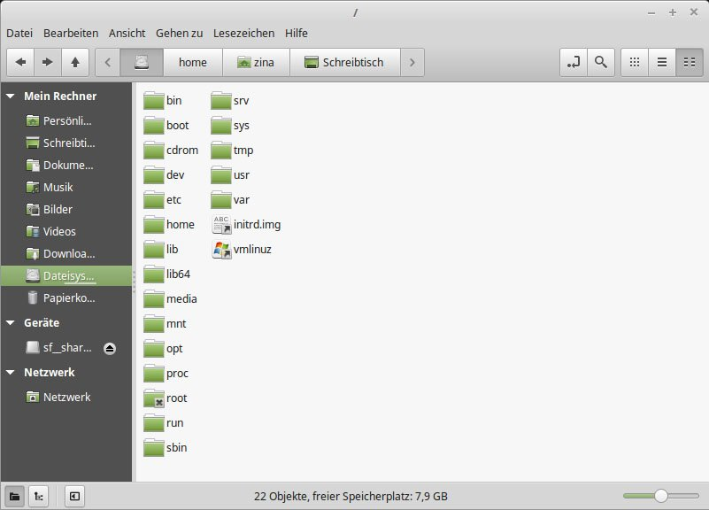

# 💻 Software

Linux ist ein Open-Source-Betriebssystem mit einer Vielzahl verfügbarer Software. Hier ist ein Überblick über einige der gängigen Kategorien von Software in Linux:

## Paketverwaltung

Linux verwendet Paketverwaltungssysteme wie APT oder YUM, um Softwarepakete herunterzuladen und zu installieren.

## Kernel
Linux verwendet einen monolithischen Kernel, der mehr Speicherplatz verbraucht, während Windows einen Mikrokernel verwendet, der weniger Speicherplatz benötigt, aber die Effizienz des Systems im Vergleich zu Linux verringert.

## Speicherort

In Linux werden Softwaredateien in verschiedenen Verzeichnissen gespeichert. Hier sind einige wichtige Verzeichnisse:

- /bin: Grundlegende ausführbare Binärdateien.
- /sbin: Ausführbare Binärdateien für Systemadministrationsaufgaben.
- /usr/bin: Ausführbare Binärdateien von Benutzeranwendungen.
- /usr/sbin: Ausführbare Binärdateien für erweiterte Systemaufgaben.
- /usr/local: Lokal installierte Software vom Systemadministrator.
- /opt: Zusätzliche Software von Drittanbietern.

## Open Source und Linux

Linux basiert auf dem Open-Source-Modell, bei dem der Quellcode der Software für jedermann frei zugänglich ist. Das bedeutet, dass Entwickler den Quellcode einsehen, ändern und anpassen können. Diese offene und kollaborative Entwicklungsumgebung hat zu einer lebendigen Community von Entwicklern und Enthusiasten geführt.

Weitere Unterkapitel:

* [Installation / Deinstallation]()

* [Aktualisierung]()